<a id="topo"></a>

# 🚀 Laboratório CI/CD da Order Status API com Jenkins, Docker Hub e Kubernetes/k3d

Laboratório local/VM de CI/CD para demonstrar, de forma objetiva e reproduzível, como uma API Node.js pode passar por validação automatizada, build Docker, publicação no Docker Hub e deploy em Kubernetes k3d a partir de uma pipeline Jenkins.

<div align="center">
  <p>
    
    
    
    
    
    
    
  </p>
  <p>
    
    
    
    
  </p>
  <p>
    <a href="#fluxo-cicd">🔄 Fluxo CI/CD</a> •
    <a href="#evidencias-do-pipeline-ci-cd">📸 Evidências</a> •
    <a href="#deploy-no-kubernetes">☸️ Deploy</a> •
    <a href="#como-executar-localmente">▶️ Executar localmente</a>
  </p>
</div>

## Status atual

- ✅ laboratório validado em ambiente local/VM com Jenkins e cluster k3d
- 📦 build `#4` concluído com publicação da imagem `las43/order-status-api:4-c36c06a`
- 🧾 pipeline declarativa implementada em `Jenkinsfile`
- 🖼️ evidências reais versionadas em `docs/images/`
- 📚 índice sanitizado das evidências em `docs/evidence/README.md`

> **Snapshot do laboratório:** `GitHub -> Jenkins -> Docker Hub -> Kubernetes/k3d -> Smoke Test`
>
> **Estado validado:** `Build #4` • `order-status-api` • `2/2 réplicas` • `Service is healthy`

## Índice

- [Visão geral](#visao-geral)
- [Objetivo do laboratório](#objetivo-do-laboratorio)
- [Problema que o projeto resolve](#problema-que-o-projeto-resolve)
- [Arquitetura da solução](#arquitetura-da-solucao)
- [Fluxo CI/CD](#fluxo-cicd)
- [Stack utilizada](#stack-utilizada)
- [Pre-requisitos](#pre-requisitos)
- [Funcionalidades da API](#funcionalidades-da-api)
- [Endpoints da API](#endpoints-da-api)
- [Estrutura do projeto](#estrutura-do-projeto)
- [Como executar localmente](#como-executar-localmente)
- [Como executar testes](#como-executar-testes)
- [Como executar com Docker](#como-executar-com-docker)
- [Deploy no Kubernetes](#deploy-no-kubernetes)
- [Pipeline Jenkins](#pipeline-jenkins)
- [Automação do job Jenkins via API](#automacao-do-job-jenkins-via-api)
- [Credenciais Jenkins](#credenciais-jenkins)
- [Integração com Docker Hub](#integracao-com-docker-hub)
- [Integração com Kubernetes/k3d](#integracao-com-kubernetes-k3d)
- [Evidências do Pipeline CI/CD](#evidencias-do-pipeline-ci-cd)
- [Solução de problemas](#troubleshooting)
- [Segurança e boas práticas](#seguranca-e-boas-praticas)
- [Boas práticas demonstradas](#boas-praticas-demonstradas)
- [Próximas melhorias](#proximas-melhorias)
- [Como este projeto demonstra habilidades profissionais](#como-este-projeto-demonstra-habilidades-profissionais)

<a id="visao-geral"></a>
## Visão geral

Este repositório apresenta a `Order Status API`, uma REST API simples para consulta e criação de pedidos em memória, utilizada como base para demonstrar uma esteira realista de entrega contínua.

O ambiente validado deste projeto é um laboratório local/VM com Jenkins e cluster k3d. O objetivo aqui é demonstrar fundamentos de CI/CD, conteinerização e deploy automatizado, e não afirmar operação em ambiente produtivo.

O foco do laboratório não é a complexidade de negócio, e sim a demonstração prática de habilidades de DevOps e CI/CD:

- validação automática com lint e testes
- build de imagem Docker para runtime de produção
- deploy com manifests Kubernetes
- pipeline declarativa no Jenkins

[⬆ Voltar ao topo](#topo)

<a id="objetivo-do-laboratorio"></a>
## Objetivo do laboratório

Construir um projeto pequeno, legível e reproduzível que permita demonstrar:

- desenvolvimento de API Node.js com boas práticas
- testes automatizados com Jest e Supertest
- conteinerização com Docker
- deploy em Kubernetes k3d
- automação de pipeline com Jenkins

[⬆ Voltar ao topo](#topo)

<a id="problema-que-o-projeto-resolve"></a>
## Problema que o projeto resolve

Em muitos estudos de CI/CD, os exemplos param no build local ou não conectam validação, imagem, registro e deploy em uma mesma jornada. Este laboratório conecta essas etapas em um fluxo único, fácil de explicar em entrevistas e fácil de evoluir com evidências reais.

[⬆ Voltar ao topo](#topo)

<a id="arquitetura-da-solucao"></a>
## Arquitetura da solução

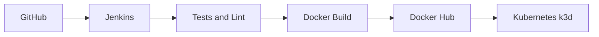

Fluxo textual resumido:

```text
GitHub -> Jenkins -> npm ci/lint/test -> Docker build -> Docker Hub -> Kubernetes/k3d -> Smoke Test
```

Componentes principais:

| Componente | Papel no laboratório |
| --- | --- |
| GitHub | hospeda o código e o Jenkinsfile |
| Jenkins | executa a pipeline declarativa |
| Node.js API | aplicação de exemplo do fluxo |
| Docker | empacota a aplicação para runtime padronizado |
| Docker Hub | armazena a imagem publicada |
| Kubernetes k3d | recebe o deploy e executa o smoke test interno |

### 🖼️ Contexto visual do repositório

**GitHub - Repositório publicado**: Comprova que o código-fonte da aplicação e a automação de CI/CD estão versionados no GitHub.

<p align="center">
  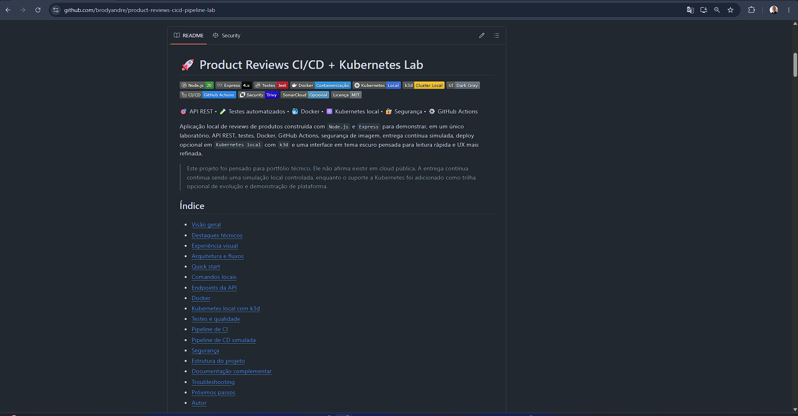
</p>

**GitHub - Jenkinsfile versionado**: Comprova que o pipeline Jenkins está definido como código no próprio repositório.

<p align="center">
  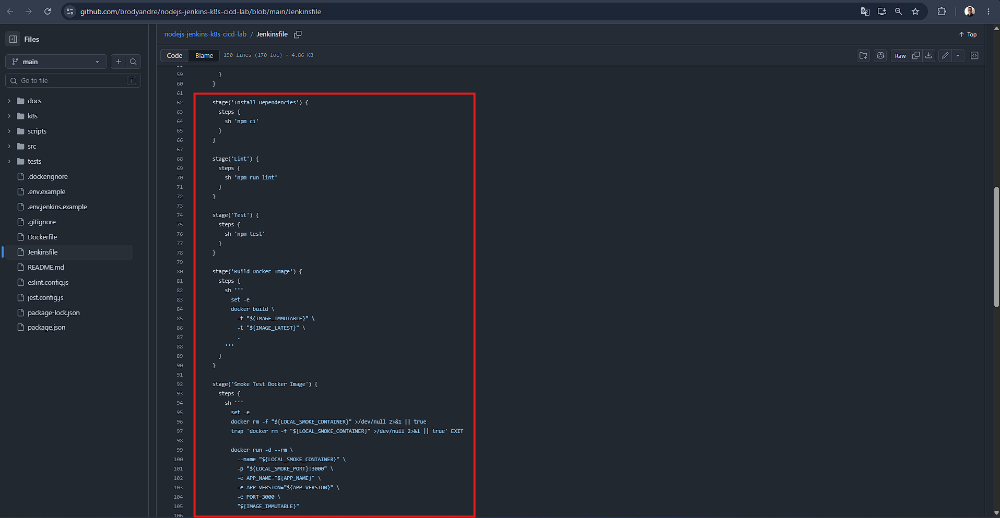
</p>

[⬆ Voltar ao topo](#topo)

<a id="fluxo-cicd"></a>
## Fluxo CI/CD

1. O código é obtido do SCM pelo Jenkins.
2. A pipeline instala dependências com `npm ci`.
3. O projeto passa por lint e testes automatizados.
4. A imagem Docker é gerada com tag imutável e `latest`.
5. A imagem pode ser publicada no Docker Hub.
6. Os manifests Kubernetes são aplicados.
7. O deployment recebe a nova imagem.
8. O rollout é acompanhado até concluir.
9. Um smoke test interno valida o endpoint `/health`.

[⬆ Voltar ao topo](#topo)

<a id="stack-utilizada"></a>
## Stack utilizada

### 🧰 Barra de tecnologias

<p>
  
  
  
  
  
  
  
  
  
  
</p>

| Camada | Tecnologias |
| --- | --- |
| API | Node.js, Express |
| Qualidade | Jest, Supertest, ESLint |
| Container | Docker, Docker Hub |
| CI/CD | Jenkins |
| Orquestração | Kubernetes, k3d |

Este conjunto foi pensado para um laboratório reproduzível, pequeno o suficiente para estudo e claro o suficiente para ser explicado em entrevistas técnicas.

[⬆ Voltar ao topo](#topo)

<a id="pre-requisitos"></a>
## Pre-requisitos

Para reproduzir o laboratório localmente, estes são os itens recomendados:

- `Node.js 18+` e `npm`
- `Docker`
- `Git`
- `kubectl`
- `k3d`, se você quiser subir e validar o cluster local
- Jenkins local/VM com acesso a `docker` e `kubectl`, caso queira executar a pipeline ponta a ponta
- conta no Docker Hub com token ou credencial equivalente para testar o push da imagem

Se o objetivo for apenas rodar a API e os testes localmente, `Node.js` e `npm` já são suficientes.

[⬆ Voltar ao topo](#topo)

<a id="funcionalidades-da-api"></a>
## Funcionalidades da API

- consulta de status operacional com `/health`
- sinalização de readiness com `/ready`
- listagem de pedidos em memória
- consulta individual por ID
- criação de pedido com validação de payload
- respostas JSON padronizadas para sucesso e erro

[⬆ Voltar ao topo](#topo)

<a id="endpoints-da-api"></a>
## Endpoints da API

| Método | Endpoint | Descrição |
| --- | --- | --- |
| `GET` | `/health` | health check da aplicação |
| `GET` | `/ready` | readiness check para runtime e Kubernetes |
| `GET` | `/api/v1/orders` | lista pedidos em memória |
| `GET` | `/api/v1/orders/:id` | busca um pedido por ID |
| `POST` | `/api/v1/orders` | cria um novo pedido |

Payload de exemplo:

```json
{
  "customerName": "Maria Silva",
  "productName": "Notebook Stand",
  "quantity": 2
}
```

[⬆ Voltar ao topo](#topo)

<a id="estrutura-do-projeto"></a>
## Estrutura do projeto

```text
.
|-- Dockerfile
|-- Jenkinsfile
|-- README.md
|-- docs/
|   |-- architecture.md
|   |-- evidence/
|   |   |-- README.md
|   |   |-- jenkins-build-4-success.log
|   |   `-- kubernetes-validation.md
|   |-- evidence-checklist.md
|   |-- images/
|   |-- jenkins-setup.md
|   |-- kubernetes-deploy.md
|   `-- troubleshooting.md
|-- scripts/
|   `-- jenkins/
|-- k8s/
|   |-- deployment.yaml
|   |-- kustomization.yaml
|   |-- namespace.yaml
|   `-- service.yaml
|-- src/
|   |-- app.js
|   |-- controllers/
|   |-- middlewares/
|   |-- routes/
|   |-- server.js
|   `-- services/
`-- tests/
    |-- integration/
    `-- unit/
```

[⬆ Voltar ao topo](#topo)

<a id="como-executar-localmente"></a>
## Como executar localmente

1. Instale as dependências:

```bash
npm ci
```

2. Crie o arquivo de ambiente:

```bash
cp .env.example .env
```

3. Inicie a API:

```bash
npm run dev
```

4. Execute a validação local:

```bash
npm run verify
```

5. Teste um endpoint:

```bash
curl http://localhost:3000/health
```

Variáveis esperadas:

```env
PORT=3000
APP_NAME=Order Status API
APP_VERSION=1.0.0
```

[⬆ Voltar ao topo](#topo)

<a id="como-executar-testes"></a>
## Como executar testes

Os testes e validações locais seguem os mesmos scripts usados pela pipeline Jenkins:

| Comando | Objetivo |
| --- | --- |
| `npm test` | executa a suíte automatizada com Jest |
| `npm run test:coverage` | gera cobertura de testes |
| `npm run lint` | valida padrões de código com ESLint |
| `npm run verify` | executa `lint` + `test` em sequência |

Os testes cobrem cenários unitários e de integração da API com `Jest` e `Supertest`.

[⬆ Voltar ao topo](#topo)

<a id="como-executar-com-docker"></a>
## Como executar com Docker

O `Dockerfile` deste projeto também é o mesmo usado pela pipeline Jenkins. Isso ajuda a reduzir diferenças entre a validação local e a validação automatizada.

Build da imagem:

```bash
docker build -t order-status-api:local .
```

Executar o container:

```bash
docker run --rm -p 3000:3000 order-status-api:local
```

Validar endpoints principais:

```bash
curl http://localhost:3000/health
curl http://localhost:3000/ready
curl http://localhost:3000/api/v1/orders
```

No fluxo validado do laboratório, a mesma imagem é gerada no Jenkins, testada localmente em container e depois publicada no Docker Hub com tag imutável e `latest`.

[⬆ Voltar ao topo](#topo)

<a id="deploy-no-kubernetes"></a>
## Deploy no Kubernetes

Os manifests da pasta `k8s/` usam o namespace `jenkins-cicd-lab`.

Para execução manual local, o `deployment.yaml` parte da imagem base `order-status-api:local`.
No fluxo validado da pipeline Jenkins, esse valor é sobrescrito com `kubectl set image` para apontar para a tag publicada no Docker Hub.

No laboratório validado, o deployment recebeu a imagem `las43/order-status-api:4-c36c06a` e concluiu rollout com `2/2` réplicas prontas.
O Service aplicado nesse fluxo usa o nome `order-status-api`, tipo `ClusterIP` e porta `3000`.

Se a imagem existir apenas localmente, importe-a no k3d:

```bash
k3d image import order-status-api:local -c <nome-do-cluster>
```

Aplicar os manifests:

```bash
kubectl apply -k k8s/
```

Verificar rollout:

```bash
kubectl -n jenkins-cicd-lab rollout status deployment/order-status-api
kubectl -n jenkins-cicd-lab get all -o wide
kubectl -n jenkins-cicd-lab get pods
kubectl -n jenkins-cicd-lab get svc
```

Smoke test interno:

```bash
kubectl -n jenkins-cicd-lab run smoke-test --rm -it --restart=Never \
  --image=curlimages/curl -- \
  curl -fsS http://order-status-api.jenkins-cicd-lab.svc.cluster.local:3000/health
```

[⬆ Voltar ao topo](#topo)

<a id="pipeline-jenkins"></a>
## Pipeline Jenkins

O `Jenkinsfile` foi estruturado para um laboratório local/VM com Docker, `kubectl`, credencial Docker Hub e credencial kubeconfig.

Resumo do fluxo da pipeline:

```text
Checkout -> npm ci -> lint -> test -> docker build -> smoke test local -> docker push -> kubectl apply/set image -> rollout -> smoke test no cluster
```

Estágios implementados:

| Estágio | Objetivo |
| --- | --- |
| `Checkout` | baixa o código e monta a tag imutável |
| `Tooling Info` | exibe versões das ferramentas do agente |
| `Install Dependencies` | instala dependências com `npm ci` |
| `Lint` | executa ESLint |
| `Test` | executa a suíte automatizada |
| `Build Docker Image` | gera a imagem local |
| `Smoke Test Docker Image` | valida a imagem via `/health` |
| `Push Docker Image to Docker Hub` | publica as tags da imagem |
| `Deploy to Kubernetes` | aplica manifests e atualiza a imagem do deployment |
| `Kubernetes Smoke Test` | testa a API via Service DNS no cluster |
| `Cleanup Local Docker Resources` | remove artefatos locais do job |

O objetivo da pipeline é demonstrar uma jornada técnica coerente de CI/CD em laboratório: validar código, empacotar a aplicação, publicar a imagem e confirmar o deploy no cluster com smoke test interno.

### 📸 Execução validada no Jenkins

**Jenkins - Job configurado**: Comprova a existência do job dedicado `nodejs-jenkins-k8s-cicd-lab` no Jenkins.

<p align="center">
  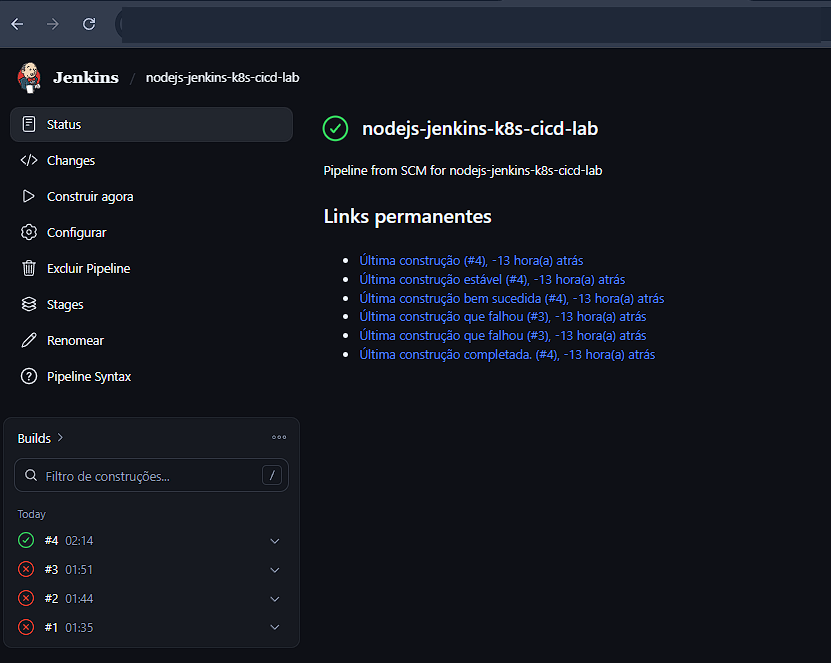
</p>

**Jenkins - Build #4 com sucesso**: Comprova a execução bem-sucedida da pipeline validada neste laboratório.

<p align="center">
  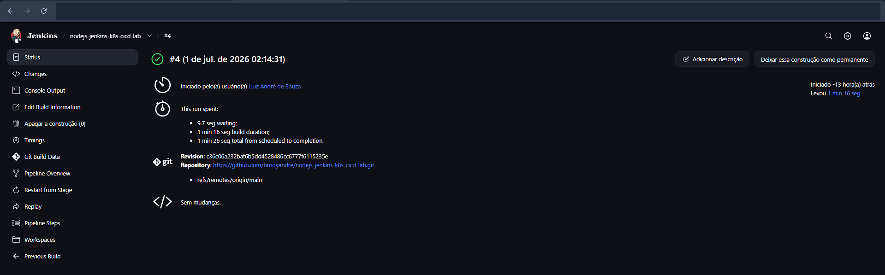
</p>

**Jenkins - Testes automatizados**: Comprova que a aplicação Node.js passou pela etapa de testes antes do empacotamento.

<p align="center">
  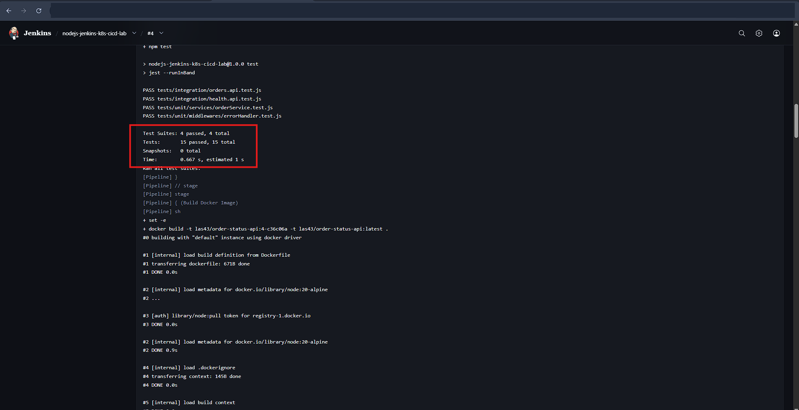
</p>

Automação do job:

- o repositório inclui `scripts/jenkins/create-pipeline-job.mjs` para criar ou atualizar o job ideal no Jenkins via API
- o `dry-run` é o comportamento padrão; o script só chama o Jenkins real com `--apply`
- para este projeto, o melhor ponto de partida é um job dedicado `nodejs-jenkins-k8s-cicd-lab`
- se no futuro você quiser validar múltiplas branches automaticamente, a evolução natural é `Multibranch Pipeline`

[⬆ Voltar ao topo](#topo)

<a id="automacao-do-job-jenkins-via-api"></a>
## Automação do job Jenkins via API

O projeto inclui um script para criar ou atualizar automaticamente um job Jenkins do tipo `Pipeline from SCM` apontando para este repositório no GitHub.

Esse fluxo foi documentado para um Jenkins local acessível por uma URL como:

```text
http://jenkins.example.local:8080
```

Pre-requisitos:

- Jenkins acessível na URL do seu ambiente
- usuário Jenkins com permissão de criação e configuração de jobs
- API token criado pelo usuário Jenkins
- repositório GitHub já publicado
- `Jenkinsfile` presente na raiz do repositório

Passos recomendados:

```bash
cp .env.jenkins.example .env.jenkins.local
npm run jenkins:job:dry-run
npm run jenkins:job:apply
npm run jenkins:job:apply-build
```

Observações importantes:

- o script carrega `.env.jenkins.local` automaticamente quando esse arquivo existir na raiz do projeto
- o `dry-run` é o comportamento padrão do script e apenas mostra o `config.xml` gerado
- a chamada real ao Jenkins só acontece com `--apply`
- o arquivo `.env.jenkins.local` nunca deve ser commitado

As capturas reais desta automação e da execução da pipeline estão documentadas em `docs/images/` e indexadas em `docs/evidence/README.md`.

[⬆ Voltar ao topo](#topo)

<a id="credenciais-jenkins"></a>
## Credenciais Jenkins

| ID da credencial | Tipo recomendado | Uso |
| --- | --- | --- |
| `dockerhub` | `Username with password` | login seguro no Docker Hub e publicação da imagem |
| `kube` | credencial com kubeconfig | autenticação do `kubectl` para deploy e validação |

Observações:

- preferir token do Docker Hub no lugar de senha
- não expor valores em capturas de tela
- revisar permissão do usuário `jenkins` para Docker e acesso ao cluster

**Jenkins - Credenciais protegidas**: Comprova que a pipeline referencia credenciais por ID, sem expor tokens, senhas ou secrets no painel.

<p align="center">
  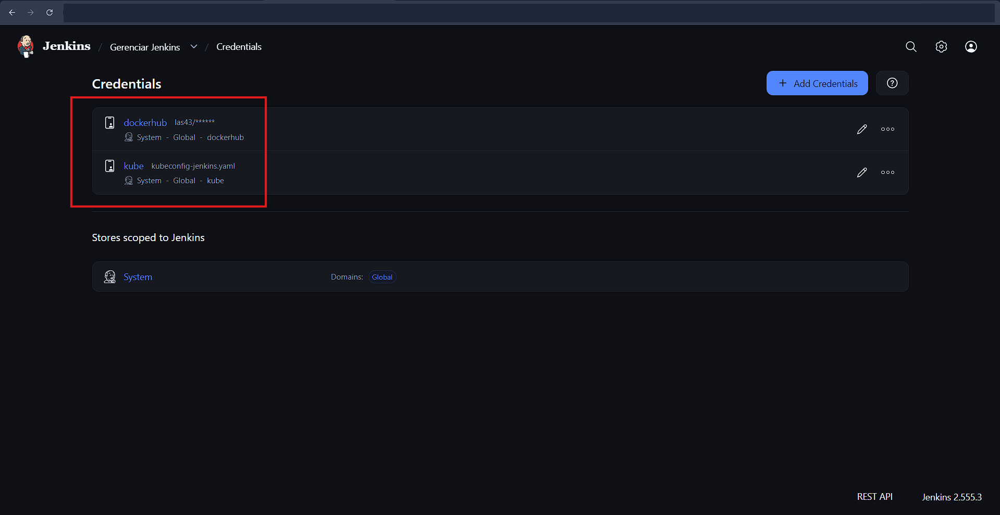
</p>

[⬆ Voltar ao topo](#topo)

<a id="integracao-com-docker-hub"></a>
## Integração com Docker Hub

A pipeline monta o nome do repositório a partir da credencial Docker Hub configurada no Jenkins. No `Jenkinsfile`, o formato é:

```text
$DOCKERHUB_USER/order-status-api
```

No fluxo validado deste laboratório, o usuário Docker Hub foi `las43` e o repositório publicado foi:

```text
las43/order-status-api
```

Estratégia de tags:

- tag imutável baseada em `BUILD_NUMBER` e `git short sha`
- tag `latest` para referência operacional

Fluxo de build e push:

1. o Jenkins gera a imagem a partir do `Dockerfile`
2. a imagem passa por smoke test local em container
3. a credencial `dockerhub` autentica o push
4. a pipeline publica a tag imutável e a tag `latest`

Exemplo validado neste laboratório:

```text
las43/order-status-api:4-c36c06a
```

**Docker - Build e smoke test local**: Comprova que a imagem foi gerada e validada localmente antes da publicação.

<p align="center">
  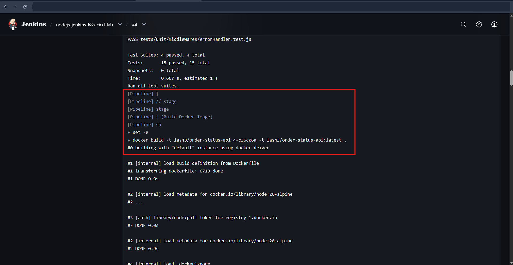
</p>

**Docker Hub - Push da imagem**: Comprova o envio da imagem para o repositório `las43/order-status-api` a partir do Jenkins.

<p align="center">
  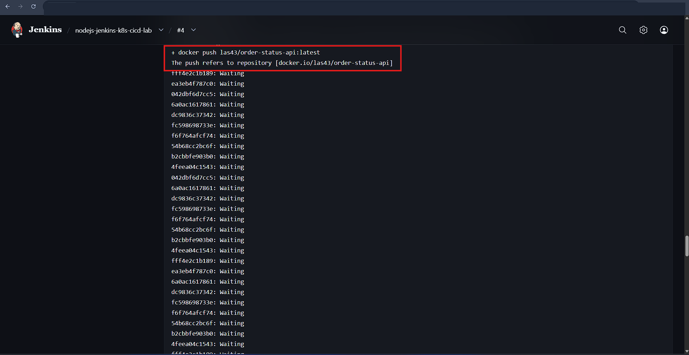
</p>

**Docker Hub - Tags publicadas**: Comprova a publicação da imagem validada `las43/order-status-api:4-c36c06a` no Docker Hub.

<p align="center">
  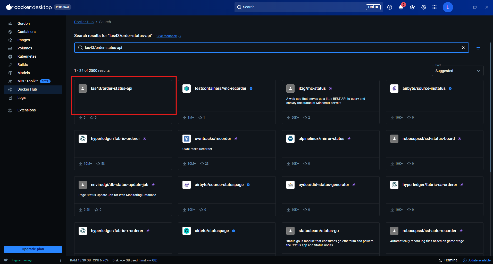
</p>

Importante:

- as evidências reais de push e tags publicadas estão registradas em `docs/images/08-jenkins-console-dockerhub-push.png` e `docs/images/11-dockerhub-order-status-api-tags.png`

[⬆ Voltar ao topo](#topo)

<a id="integracao-com-kubernetes-k3d"></a>
## Integração com Kubernetes/k3d

O laboratório foi preparado para um cluster local k3d com:

- namespace dedicado `jenkins-cicd-lab`
- `Service` chamado `order-status-api`
- `Deployment` com 2 réplicas
- `Service` `ClusterIP`
- porta `3000` exposta no Service e no container
- `readinessProbe` em `/ready`
- `livenessProbe` em `/health`

Fluxo de deploy:

1. a pipeline aplica os manifests com `kubectl apply -k k8s/`
2. o deployment `order-status-api` recebe a nova imagem via `kubectl set image`
3. o Jenkins acompanha o rollout até concluir
4. um pod temporário executa `curl` contra o Service interno

Isso permite demonstrar conceitos de deploy seguro, rollout controlado e verificação de saúde da aplicação em um cluster local de laboratório.

**Kubernetes - Deploy no k3d**: Comprova a etapa de entrega contínua para o namespace `jenkins-cicd-lab` e o deployment `order-status-api`.

<p align="center">
  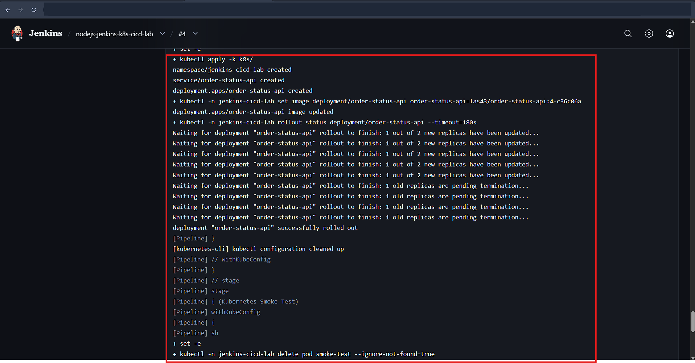
</p>

**Kubernetes - `kubectl get all`**: Comprova a visão consolidada dos recursos implantados no namespace `jenkins-cicd-lab`.

<p align="center">
  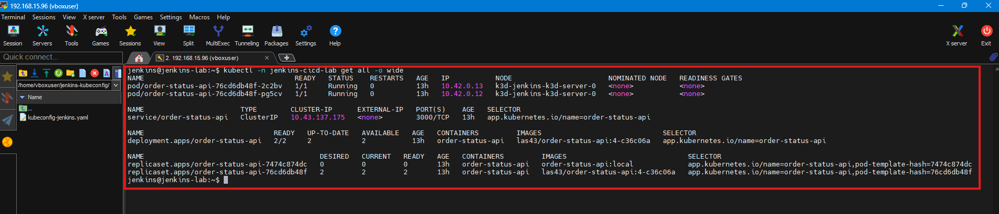
</p>

**Kubernetes - Rollout concluído**: Comprova que o deployment `order-status-api` atingiu estado pronto com `2/2` réplicas no namespace alvo.

<p align="center">
  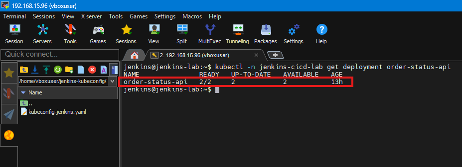
</p>

**Kubernetes - Smoke test do serviço**: Comprova a validação pós-deploy com a resposta `Service is healthy`.

<p align="center">
  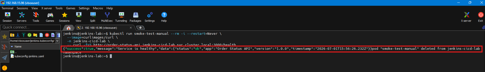
</p>

Para manter o README focado no fluxo principal, capturas mais operacionais, como `Tooling Info`, `node Ready`, `pods Running`, `Service ClusterIP`, templates de agente e detalhes adicionais de validação, permanecem concentradas em `docs/evidence/README.md` e `docs/evidence/kubernetes-validation.md`.

[⬆ Voltar ao topo](#topo)

<a id="evidencias-do-pipeline-ci-cd"></a>
## Evidências do Pipeline CI/CD

Esta seção continua fazendo sentido para empregabilidade porque resume, em um único ponto, o que um recrutador técnico consegue comprovar sem precisar percorrer todo o README. As imagens do fluxo principal já aparecem contextualizadas nas seções técnicas acima; aqui o foco é destacar **quais competências práticas ficaram comprovadas**.

### O que este laboratório comprova

| Competência demonstrada | Evidência validada | Onde inspecionar |
| --- | --- | --- |
| CI/CD como código | Repositório publicado com `Jenkinsfile` versionado e fluxo declarativo definido no Git | [Arquitetura da solução](#arquitetura-da-solucao) e [Pipeline Jenkins](#pipeline-jenkins) |
| Qualidade automatizada | Pipeline Jenkins executando `npm ci`, lint e testes antes do empacotamento | [Pipeline Jenkins](#pipeline-jenkins) |
| Conteinerização e publish | Imagem Docker criada, validada via smoke test local e publicada no Docker Hub como `las43/order-status-api:4-c36c06a` | [Integração com Docker Hub](#integracao-com-docker-hub) |
| Deploy em Kubernetes | Atualização automatizada do deployment `order-status-api` no namespace `jenkins-cicd-lab` | [Integração com Kubernetes/k3d](#integracao-com-kubernetes-k3d) e [Deploy no Kubernetes](#deploy-no-kubernetes) |
| Validação operacional pós-deploy | Rollout acompanhado, recursos no cluster conferidos e smoke test final retornando `Service is healthy` | [Integração com Kubernetes/k3d](#integracao-com-kubernetes-k3d) |
| Higiene de segurança e documentação | Credenciais protegidas, `.env.jenkins.local` fora do Git e evidências sanitizadas para portfólio | [Segurança e boas práticas](#seguranca-e-boas-praticas) e [docs/evidence/README.md](docs/evidence/README.md) |

### Seções-chave para leitura rápida

Para uma revisão objetiva do laboratório, estas seções concentram o fluxo validado e as evidências principais:

1. [Status atual](#status-atual)
2. [Fluxo CI/CD](#fluxo-cicd)
3. [Pipeline Jenkins](#pipeline-jenkins)
4. [Integração com Docker Hub](#integracao-com-docker-hub)
5. [Integração com Kubernetes/k3d](#integracao-com-kubernetes-k3d)

### Índice técnico das evidências

Para auditoria detalhada dos artefatos, capturas e comprovações técnicas:

- [docs/evidence/README.md](docs/evidence/README.md)
- [docs/evidence/kubernetes-validation.md](docs/evidence/kubernetes-validation.md)
- [docs/images/](docs/images/)

O README principal destaca apenas as evidências mais relevantes para leitura de portfólio; os registros mais operacionais continuam organizados no índice técnico acima.

[⬆ Voltar ao topo](#topo)

<a id="troubleshooting"></a>
## Solução de problemas

| Sintoma | Possível causa | Ação recomendada |
| --- | --- | --- |
| `Docker permission denied` | usuário do Jenkins sem acesso ao daemon | adicionar o usuário ao grupo `docker` e reiniciar a sessão |
| `kubectl sem contexto` | kubeconfig ausente ou inválido | revisar a credencial `kube` e testar os contextos |
| `credencial kube não encontrada` | ID divergente no Jenkins | confirmar o uso exato de `kube` |
| `Docker Hub login failed` | token ou usuário inválidos | atualizar a credencial `dockerhub` |
| `image pull error` | imagem não publicada ou tag incorreta | validar nome do repositório e tag no deployment |
| `pod CrashLoopBackOff` | falha no startup ou probes incorretas | revisar logs, describe e configuração dos endpoints |
| `Jenkins não cria agent` | agente offline ou mal configurado | revisar status do node, labels e capacidade de execução |

Documentação complementar:

- [docs/troubleshooting.md](docs/troubleshooting.md)

[⬆ Voltar ao topo](#topo)

<a id="seguranca-e-boas-praticas"></a>
## Segurança e boas práticas

- `.env.jenkins.local` é mantido fora do versionamento
- `.env.jenkins.example` usa placeholders seguros
- credenciais Jenkins são referenciadas por ID, sem exposição de valores
- kubeconfig não é armazenado no repositório
- o `Dockerfile` executa a aplicação com usuário não-root
- os logs e capturas publicados em `docs/` foram revisados para não expor secrets

Como este projeto é um laboratório local/VM, o foco é demonstrar disciplina técnica e higiene operacional básica, não políticas completas de segurança corporativa.

[⬆ Voltar ao topo](#topo)

<a id="boas-praticas-demonstradas"></a>
## Boas práticas demonstradas

- separação clara entre aplicação, testes, infraestrutura e documentação
- API simples e reproduzível, sem banco externo
- validação automatizada antes de empacotar e publicar
- imagem Docker enxuta com usuário não-root
- manifests Kubernetes com probes e recursos definidos
- pipeline declarativa com credenciais protegidas
- documentação com evidências reais versionadas e índice sanitizado para portfólio

[⬆ Voltar ao topo](#topo)

<a id="proximas-melhorias"></a>
## Próximas melhorias

- adicionar badge público de pipeline quando houver integração aberta no GitHub
- incluir scanner de vulnerabilidades da imagem
- separar overlays por ambiente com Kustomize
- adicionar estratégia de rollback automatizado
- incluir release notes ou versionamento semântico

[⬆ Voltar ao topo](#topo)

<a id="como-este-projeto-demonstra-habilidades-profissionais"></a>
## Como este projeto demonstra habilidades profissionais

Este repositório evidencia competências práticas relevantes para vagas juniores ou pleno inicial em DevOps, Cloud, SRE e Engenharia de Dados com CI/CD:

- automação de qualidade e validação contínua
- conteinerização orientada a runtime de produção
- deploy em Kubernetes com verificação operacional
- documentação técnica clara para operação e portfólio
- preocupação com rastreabilidade, segurança e apresentação profissional

Documentação auxiliar:

- [docs/architecture.md](docs/architecture.md)
- [docs/evidence/README.md](docs/evidence/README.md)
- [docs/evidence/kubernetes-validation.md](docs/evidence/kubernetes-validation.md)
- [docs/jenkins-setup.md](docs/jenkins-setup.md)
- [docs/kubernetes-deploy.md](docs/kubernetes-deploy.md)
- [docs/evidence-checklist.md](docs/evidence-checklist.md)

[⬆ Voltar ao topo](#topo)
