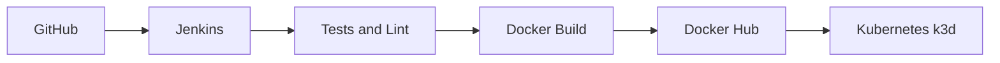

<a id="topo"></a>

# 🚀 Order Status API CI/CD Lab with Jenkins, Docker Hub, and Kubernetes/k3d

Laboratorio local/VM de CI/CD para demonstrar, de forma objetiva e reproduzivel, como uma API Node.js pode passar por validacao automatizada, build Docker, publicacao no Docker Hub e deploy em Kubernetes k3d a partir de uma pipeline Jenkins.

<div align="center">
  <p>
    
    
    
    
    
    
    
  </p>
  <p>
    
    
    
    
  </p>
  <p>
    <a href="#fluxo-cicd">🔄 Fluxo CI/CD</a> •
    <a href="#evidencias-do-pipeline-ci-cd">📸 Evidências</a> •
    <a href="#deploy-no-kubernetes">☸️ Deploy</a> •
    <a href="#como-executar-localmente">▶️ Run Local</a>
  </p>
</div>

## Status atual

- ✅ laboratorio validado em ambiente local/VM com Jenkins e cluster k3d
- 📦 build `#4` concluido com publicacao da imagem `las43/order-status-api:4-c36c06a`
- 🧾 pipeline declarativa implementada em `Jenkinsfile`
- 🖼️ evidencias reais versionadas em `docs/images/`
- 📚 indice sanitizado das evidencias em `docs/evidence/README.md`

> **Snapshot do laboratorio:** `GitHub -> Jenkins -> Docker Hub -> Kubernetes/k3d -> Smoke Test`
>
> **Estado validado:** `Build #4` • `order-status-api` • `2/2 replicas` • `Service is healthy`

## Indice

- [Visao geral](#visao-geral)
- [Objetivo do laboratorio](#objetivo-do-laboratorio)
- [Problema que o projeto resolve](#problema-que-o-projeto-resolve)
- [Arquitetura da solucao](#arquitetura-da-solucao)
- [Fluxo CI/CD](#fluxo-cicd)
- [Stack utilizada](#stack-utilizada)
- [Pre-requisitos](#pre-requisitos)
- [Funcionalidades da API](#funcionalidades-da-api)
- [Endpoints da API](#endpoints-da-api)
- [Estrutura do projeto](#estrutura-do-projeto)
- [Como executar localmente](#como-executar-localmente)
- [Como executar testes](#como-executar-testes)
- [Como executar com Docker](#como-executar-com-docker)
- [Deploy no Kubernetes](#deploy-no-kubernetes)
- [Pipeline Jenkins](#pipeline-jenkins)
- [Automacao do job Jenkins via API](#automacao-do-job-jenkins-via-api)
- [Credenciais Jenkins](#credenciais-jenkins)
- [Integracao com Docker Hub](#integracao-com-docker-hub)
- [Integracao com Kubernetes/k3d](#integracao-com-kubernetes-k3d)
- [Evidências do Pipeline CI/CD](#evidencias-do-pipeline-ci-cd)
- [Troubleshooting](#troubleshooting)
- [Seguranca e boas praticas](#seguranca-e-boas-praticas)
- [Boas praticas demonstradas](#boas-praticas-demonstradas)
- [Proximas melhorias](#proximas-melhorias)
- [Como este projeto demonstra habilidades profissionais](#como-este-projeto-demonstra-habilidades-profissionais)

<a id="visao-geral"></a>
## Visao geral

Este repositorio apresenta a `Order Status API`, uma REST API simples para consulta e criacao de pedidos em memoria, utilizada como base para demonstrar uma esteira realista de entrega continua.

O ambiente validado deste projeto e um laboratorio local/VM com Jenkins e cluster k3d. O objetivo aqui e demonstrar fundamentos de CI/CD, conteinerizacao e deploy automatizado, e nao afirmar operacao em ambiente produtivo.

O foco do laboratorio nao e a complexidade de negocio, e sim a demonstracao pratica de habilidades de DevOps e CI/CD:

- validacao automatica com lint e testes
- build de imagem Docker para runtime de producao
- deploy com manifests Kubernetes
- pipeline declarativa no Jenkins

[⬆ Voltar ao topo](#topo)

<a id="objetivo-do-laboratorio"></a>
## Objetivo do laboratorio

Construir um projeto pequeno, legivel e reproduzivel que permita demonstrar:

- desenvolvimento de API Node.js com boas praticas
- testes automatizados com Jest e Supertest
- containerizacao com Docker
- deploy em Kubernetes k3d
- automacao de pipeline com Jenkins

[⬆ Voltar ao topo](#topo)

<a id="problema-que-o-projeto-resolve"></a>
## Problema que o projeto resolve

Em muitos estudos de CI/CD, os exemplos param no build local ou nao conectam validacao, imagem, registro e deploy em uma mesma jornada. Este laboratorio conecta essas etapas em um fluxo unico, facil de explicar em entrevistas e facil de evoluir com evidencias reais.

[⬆ Voltar ao topo](#topo)

<a id="arquitetura-da-solucao"></a>
## Arquitetura da solucao



Fluxo textual resumido:

```text
GitHub -> Jenkins -> npm ci/lint/test -> Docker build -> Docker Hub -> Kubernetes/k3d -> Smoke Test
```

Componentes principais:

| Componente | Papel no laboratorio |
| --- | --- |
| GitHub | hospeda o codigo e o Jenkinsfile |
| Jenkins | executa a pipeline declarativa |
| Node.js API | aplicacao de exemplo do fluxo |
| Docker | empacota a aplicacao para runtime padronizado |
| Docker Hub | armazena a imagem publicada |
| Kubernetes k3d | recebe o deploy e executa o smoke test interno |

[⬆ Voltar ao topo](#topo)

<a id="fluxo-cicd"></a>
## Fluxo CI/CD

1. O codigo e obtido do SCM pelo Jenkins.
2. A pipeline instala dependencias com `npm ci`.
3. O projeto passa por lint e testes automatizados.
4. A imagem Docker e gerada com tag imutavel e `latest`.
5. A imagem pode ser publicada no Docker Hub.
6. Os manifests Kubernetes sao aplicados.
7. O deployment recebe a nova imagem.
8. O rollout e acompanhado ate concluir.
9. Um smoke test interno valida o endpoint `/health`.

[⬆ Voltar ao topo](#topo)

<a id="stack-utilizada"></a>
## Stack utilizada

### 🧰 Barra de tecnologias

<p>
  
  
  
  
  
  
  
  
  
  
</p>

| Camada | Tecnologias |
| --- | --- |
| API | Node.js, Express |
| Qualidade | Jest, Supertest, ESLint |
| Container | Docker, Docker Hub |
| CI/CD | Jenkins |
| Orquestracao | Kubernetes, k3d |

Este conjunto foi pensado para um laboratorio reproduzivel, pequeno o suficiente para estudo e claro o suficiente para ser explicado em entrevistas tecnicas.

[⬆ Voltar ao topo](#topo)

<a id="pre-requisitos"></a>
## Pre-requisitos

Para reproduzir o laboratorio localmente, estes sao os itens recomendados:

- `Node.js 18+` e `npm`
- `Docker`
- `Git`
- `kubectl`
- `k3d`, se voce quiser subir e validar o cluster local
- Jenkins local/VM com acesso a `docker` e `kubectl`, caso queira executar a pipeline ponta a ponta
- conta no Docker Hub com token ou credencial equivalente para testar o push da imagem

Se o objetivo for apenas rodar a API e os testes localmente, `Node.js` e `npm` ja sao suficientes.

[⬆ Voltar ao topo](#topo)

<a id="funcionalidades-da-api"></a>
## Funcionalidades da API

- consulta de status operacional com `/health`
- sinalizacao de readiness com `/ready`
- listagem de pedidos em memoria
- consulta individual por ID
- criacao de pedido com validacao de payload
- respostas JSON padronizadas para sucesso e erro

[⬆ Voltar ao topo](#topo)

<a id="endpoints-da-api"></a>
## Endpoints da API

| Metodo | Endpoint | Descricao |
| --- | --- | --- |
| `GET` | `/health` | health check da aplicacao |
| `GET` | `/ready` | readiness check para runtime e Kubernetes |
| `GET` | `/api/v1/orders` | lista pedidos em memoria |
| `GET` | `/api/v1/orders/:id` | busca um pedido por ID |
| `POST` | `/api/v1/orders` | cria um novo pedido |

Payload de exemplo:

```json
{
  "customerName": "Maria Silva",
  "productName": "Notebook Stand",
  "quantity": 2
}
```

[⬆ Voltar ao topo](#topo)

<a id="estrutura-do-projeto"></a>
## Estrutura do projeto

```text
.
|-- Dockerfile
|-- Jenkinsfile
|-- README.md
|-- docs/
|   |-- architecture.md
|   |-- evidence/
|   |   |-- README.md
|   |   |-- jenkins-build-4-success.log
|   |   `-- kubernetes-validation.md
|   |-- evidence-checklist.md
|   |-- images/
|   |-- jenkins-setup.md
|   |-- kubernetes-deploy.md
|   `-- troubleshooting.md
|-- scripts/
|   `-- jenkins/
|-- k8s/
|   |-- deployment.yaml
|   |-- kustomization.yaml
|   |-- namespace.yaml
|   `-- service.yaml
|-- src/
|   |-- app.js
|   |-- controllers/
|   |-- middlewares/
|   |-- routes/
|   |-- server.js
|   `-- services/
`-- tests/
    |-- integration/
    `-- unit/
```

[⬆ Voltar ao topo](#topo)

<a id="como-executar-localmente"></a>
## Como executar localmente

1. Instale as dependencias:

```bash
npm ci
```

2. Crie o arquivo de ambiente:

```bash
cp .env.example .env
```

3. Inicie a API:

```bash
npm run dev
```

4. Execute a validacao local:

```bash
npm run verify
```

5. Teste um endpoint:

```bash
curl http://localhost:3000/health
```

Variaveis esperadas:

```env
PORT=3000
APP_NAME=Order Status API
APP_VERSION=1.0.0
```

[⬆ Voltar ao topo](#topo)

<a id="como-executar-testes"></a>
## Como executar testes

Os testes e validacoes locais seguem os mesmos scripts usados pela pipeline Jenkins:

| Comando | Objetivo |
| --- | --- |
| `npm test` | executa a suite automatizada com Jest |
| `npm run test:coverage` | gera cobertura de testes |
| `npm run lint` | valida padroes de codigo com ESLint |
| `npm run verify` | executa `lint` + `test` em sequencia |

Os testes cobrem cenarios unitarios e de integracao da API com `Jest` e `Supertest`.

[⬆ Voltar ao topo](#topo)

<a id="como-executar-com-docker"></a>
## Como executar com Docker

O `Dockerfile` deste projeto tambem e o mesmo usado pela pipeline Jenkins. Isso ajuda a reduzir diferencas entre a validacao local e a validacao automatizada.

Build da imagem:

```bash
docker build -t order-status-api:local .
```

Executar o container:

```bash
docker run --rm -p 3000:3000 order-status-api:local
```

Validar endpoints principais:

```bash
curl http://localhost:3000/health
curl http://localhost:3000/ready
curl http://localhost:3000/api/v1/orders
```

No fluxo validado do laboratorio, a mesma imagem e gerada no Jenkins, testada localmente em container e depois publicada no Docker Hub com tag imutavel e `latest`.

[⬆ Voltar ao topo](#topo)

<a id="deploy-no-kubernetes"></a>
## Deploy no Kubernetes

Os manifests da pasta `k8s/` usam o namespace `jenkins-cicd-lab`.

Para execucao manual local, o `deployment.yaml` parte da imagem base `order-status-api:local`.
No fluxo validado da pipeline Jenkins, esse valor e sobrescrito com `kubectl set image` para apontar para a tag publicada no Docker Hub.

No laboratorio validado, o deployment recebeu a imagem `las43/order-status-api:4-c36c06a` e concluiu rollout com `2/2` replicas prontas.
O Service aplicado nesse fluxo usa o nome `order-status-api`, tipo `ClusterIP` e porta `3000`.

Se a imagem existir apenas localmente, importe-a no k3d:

```bash
k3d image import order-status-api:local -c <nome-do-cluster>
```

Aplicar os manifests:

```bash
kubectl apply -k k8s/
```

Verificar rollout:

```bash
kubectl -n jenkins-cicd-lab rollout status deployment/order-status-api
kubectl -n jenkins-cicd-lab get all -o wide
kubectl -n jenkins-cicd-lab get pods
kubectl -n jenkins-cicd-lab get svc
```

Smoke test interno:

```bash
kubectl -n jenkins-cicd-lab run smoke-test --rm -it --restart=Never \
  --image=curlimages/curl -- \
  curl -fsS http://order-status-api.jenkins-cicd-lab.svc.cluster.local:3000/health
```

[⬆ Voltar ao topo](#topo)

<a id="pipeline-jenkins"></a>
## Pipeline Jenkins

O `Jenkinsfile` foi estruturado para um laboratorio local/VM com Docker, `kubectl`, credencial Docker Hub e credencial kubeconfig.

Resumo do fluxo da pipeline:

```text
Checkout -> npm ci -> lint -> test -> docker build -> smoke test local -> docker push -> kubectl apply/set image -> rollout -> smoke test no cluster
```

Estagios implementados:

| Estagio | Objetivo |
| --- | --- |
| `Checkout` | baixa o codigo e monta a tag imutavel |
| `Tooling Info` | exibe versoes das ferramentas do agente |
| `Install Dependencies` | instala dependencias com `npm ci` |
| `Lint` | executa ESLint |
| `Test` | executa a suite automatizada |
| `Build Docker Image` | gera a imagem local |
| `Smoke Test Docker Image` | valida a imagem via `/health` |
| `Push Docker Image to Docker Hub` | publica as tags da imagem |
| `Deploy to Kubernetes` | aplica manifests e atualiza a imagem do deployment |
| `Kubernetes Smoke Test` | testa a API via Service DNS no cluster |
| `Cleanup Local Docker Resources` | remove artefatos locais do job |

O objetivo da pipeline e demonstrar uma jornada tecnica coerente de CI/CD em laboratorio: validar codigo, empacotar a aplicacao, publicar a imagem e confirmar o deploy no cluster com smoke test interno.

Automacao do job:

- o repositorio inclui `scripts/jenkins/create-pipeline-job.mjs` para criar ou atualizar o job ideal no Jenkins via API
- o `dry-run` e o comportamento padrao; o script so chama o Jenkins real com `--apply`
- para este projeto, o melhor ponto de partida e um job dedicado `nodejs-jenkins-k8s-cicd-lab`
- se no futuro voce quiser validar multiplas branches automaticamente, a evolucao natural e `Multibranch Pipeline`

[⬆ Voltar ao topo](#topo)

<a id="automacao-do-job-jenkins-via-api"></a>
## Automação do job Jenkins via API

O projeto inclui um script para criar ou atualizar automaticamente um job Jenkins do tipo `Pipeline from SCM` apontando para este repositório no GitHub.

Esse fluxo foi documentado para um Jenkins local acessivel por uma URL como:

```text
http://jenkins.example.local:8080
```

Pre-requisitos:

- Jenkins acessivel na URL do seu ambiente
- usuario Jenkins com permissao de criacao e configuracao de jobs
- API token criado pelo usuario Jenkins
- repositorio GitHub ja publicado
- `Jenkinsfile` presente na raiz do repositório

Passos recomendados:

```bash
cp .env.jenkins.example .env.jenkins.local
npm run jenkins:job:dry-run
npm run jenkins:job:apply
npm run jenkins:job:apply-build
```

Observacoes importantes:

- o script carrega `.env.jenkins.local` automaticamente quando esse arquivo existir na raiz do projeto
- o `dry-run` e o comportamento padrao do script e apenas mostra o `config.xml` gerado
- a chamada real ao Jenkins so acontece com `--apply`
- o arquivo `.env.jenkins.local` nunca deve ser commitado

As capturas reais desta automacao e da execucao da pipeline estao documentadas em `docs/images/` e indexadas em `docs/evidence/README.md`.

[⬆ Voltar ao topo](#topo)

<a id="credenciais-jenkins"></a>
## Credenciais Jenkins

| Credential ID | Tipo recomendado | Uso |
| --- | --- | --- |
| `dockerhub` | `Username with password` | login seguro no Docker Hub e publicacao da imagem |
| `kube` | credencial com kubeconfig | autenticacao do `kubectl` para deploy e validacao |

Observacoes:

- preferir token do Docker Hub no lugar de senha
- nao expor valores em capturas de tela
- revisar permissao do usuario `jenkins` para Docker e acesso ao cluster

[⬆ Voltar ao topo](#topo)

<a id="integracao-com-docker-hub"></a>
## Integracao com Docker Hub

A pipeline monta o nome do repositorio a partir da credencial Docker Hub configurada no Jenkins. No `Jenkinsfile`, o formato e:

```text
$DOCKERHUB_USER/order-status-api
```

No fluxo validado deste laboratorio, o usuario Docker Hub foi `las43` e o repositorio publicado foi:

```text
las43/order-status-api
```

Estrategia de tags:

- tag imutavel baseada em `BUILD_NUMBER` e `git short sha`
- tag `latest` para referencia operacional

Fluxo de build e push:

1. o Jenkins gera a imagem a partir do `Dockerfile`
2. a imagem passa por smoke test local em container
3. a credencial `dockerhub` autentica o push
4. a pipeline publica a tag imutavel e a tag `latest`

Exemplo validado neste laboratorio:

```text
las43/order-status-api:4-c36c06a
```

Importante:

- as evidencias reais de push e tags publicadas estao registradas em `docs/images/08-jenkins-console-dockerhub-push.png` e `docs/images/11-dockerhub-order-status-api-tags.png`

[⬆ Voltar ao topo](#topo)

<a id="integracao-com-kubernetes-k3d"></a>
## Integracao com Kubernetes/k3d

O laboratorio foi preparado para um cluster local k3d com:

- namespace dedicado `jenkins-cicd-lab`
- `Service` chamado `order-status-api`
- `Deployment` com 2 replicas
- `Service` `ClusterIP`
- porta `3000` exposta no Service e no container
- `readinessProbe` em `/ready`
- `livenessProbe` em `/health`

Fluxo de deploy:

1. a pipeline aplica os manifests com `kubectl apply -k k8s/`
2. o deployment `order-status-api` recebe a nova imagem via `kubectl set image`
3. o Jenkins acompanha o rollout ate concluir
4. um pod temporario executa `curl` contra o Service interno

Isso permite demonstrar conceitos de deploy seguro, rollout controlado e verificacao de saude da aplicacao em um cluster local de laboratorio.

[⬆ Voltar ao topo](#topo)

<a id="evidencias-do-pipeline-ci-cd"></a>
## Evidências do Pipeline CI/CD

As evidencias abaixo documentam a execucao real da pipeline CI/CD da aplicacao Node.js com Jenkins, Docker, Docker Hub e Kubernetes/k3d. O fluxo validado corresponde ao `Build #4`, com publicacao da imagem `las43/order-status-api:4-c36c06a`, deploy no namespace `jenkins-cicd-lab` e smoke test final com retorno `Service is healthy`.

### Fluxo principal validado

- **GitHub - Repositório publicado**: Comprova que o codigo-fonte da aplicacao e a automacao de CI/CD estao versionados no GitHub. [Abrir imagem](docs/images/01-github-repository.png)
- **GitHub - Jenkinsfile versionado**: Comprova que o pipeline Jenkins esta definido como codigo no proprio repositorio. [Abrir imagem](docs/images/02-github-jenkinsfile-pipeline-stages.png)
- **Jenkins - Job configurado**: Comprova a existencia do job dedicado `nodejs-jenkins-k8s-cicd-lab` no Jenkins. [Abrir imagem](docs/images/03-jenkins-job-dashboard.png)
- **Jenkins - Build #4 com sucesso**: Comprova a execucao bem-sucedida da pipeline validada neste laboratorio. [Abrir imagem](docs/images/04-jenkins-build-4-success.png)
- **Jenkins - Testes automatizados**: Comprova que a aplicacao Node.js passou pela etapa de testes antes do empacotamento. [Abrir imagem](docs/images/06-jenkins-console-tests-passed.png)
- **Docker - Build e smoke test local**: Comprova que a imagem foi gerada e validada localmente antes da publicacao. [Abrir imagem](docs/images/07-jenkins-console-docker-build-smoke.png)
- **Docker Hub - Push da imagem**: Comprova o envio da imagem para o repositorio `las43/order-status-api` a partir do Jenkins. [Abrir imagem](docs/images/08-jenkins-console-dockerhub-push.png)
- **Docker Hub - Tags publicadas**: Comprova a publicacao da imagem validada `las43/order-status-api:4-c36c06a` no Docker Hub. [Abrir imagem](docs/images/11-dockerhub-order-status-api-tags.png)
- **Kubernetes - Deploy no k3d**: Comprova a etapa de entrega continua para o namespace `jenkins-cicd-lab` e o deployment `order-status-api`. [Abrir imagem](docs/images/09-jenkins-console-kubernetes-deploy.png)
- **Kubernetes - `kubectl get all`**: Comprova a visao consolidada dos recursos implantados no namespace `jenkins-cicd-lab`. [Abrir imagem](docs/images/13-kubernetes-get-all-wide.png)
- **Kubernetes - Smoke test do servico**: Comprova a validacao pos-deploy com a resposta `Service is healthy`. [Abrir imagem](docs/images/17-kubernetes-smoke-test-success.png)

### Evidências complementares

- **Jenkins - Informacoes do agente**: Comprova a disponibilidade das ferramentas necessarias para a execucao da pipeline no agente Jenkins. [Abrir imagem](docs/images/05-jenkins-console-tooling-info.png)
- **Kubernetes - Smoke test no console do Jenkins**: Comprova que a pipeline registrou sucesso na verificacao do servico dentro do cluster. [Abrir imagem](docs/images/10-jenkins-console-kubernetes-smoke-success.png)
- **Kubernetes - No pronto**: Comprova que o ambiente k3d estava operacional durante a validacao do deploy. [Abrir imagem](docs/images/12-kubernetes-node-ready.png)
- **Kubernetes - Deployment pronto**: Comprova que o deployment `order-status-api` atingiu estado pronto no namespace alvo. [Abrir imagem](docs/images/14-kubernetes-deployment-ready.png)
- **Kubernetes - Pods em execucao**: Comprova que os pods da aplicacao permaneceram ativos apos o deploy. [Abrir imagem](docs/images/15-kubernetes-pods-running.png)
- **Kubernetes - Service publicado**: Comprova a exposicao interna do servico da aplicacao no cluster. [Abrir imagem](docs/images/16-kubernetes-service.png)
- **Jenkins - Kubernetes Cloud Provider**: Comprova a configuracao de integracao entre Jenkins e Kubernetes para evolucoes futuras do laboratorio. [Abrir imagem](docs/images/18-jenkins-kubernetes-cloud-provider.png)
- **Jenkins - Template de agente Kubernetes**: Comprova a existencia de um template de agente para execucoes orientadas a Kubernetes. [Abrir imagem](docs/images/19-jenkins-k8s-agent-template.png)
- **Jenkins - Credenciais protegidas**: Comprova que os IDs de credenciais estao registrados sem exposicao de segredos. [Abrir imagem](docs/images/20-jenkins-credentials-list-safe.png)
- **Projeto - Estrutura do repositorio**: Comprova a organizacao do codigo, manifests, testes e documentacao tecnica. [Abrir imagem](docs/images/21-project-structure.png)
- **Projeto - Organizacao das evidencias**: Comprova a estrutura adotada para documentar capturas e evidencias do pipeline. [Abrir imagem](docs/images/22-docs-evidence-files.png)

[⬆ Voltar ao topo](#topo)

<a id="troubleshooting"></a>
## Troubleshooting

| Sintoma | Possivel causa | Acao recomendada |
| --- | --- | --- |
| `Docker permission denied` | usuario do Jenkins sem acesso ao daemon | adicionar o usuario ao grupo `docker` e reiniciar a sessao |
| `kubectl sem contexto` | kubeconfig ausente ou invalido | revisar a credencial `kube` e testar os contextos |
| `credencial kube nao encontrada` | ID divergente no Jenkins | confirmar o uso exato de `kube` |
| `Docker Hub login failed` | token ou usuario invalidos | atualizar a credencial `dockerhub` |
| `image pull error` | imagem nao publicada ou tag incorreta | validar nome do repositorio e tag no deployment |
| `pod CrashLoopBackOff` | falha no startup ou probes incorretas | revisar logs, describe e configuracao dos endpoints |
| `Jenkins nao cria agent` | agente offline ou mal configurado | revisar status do node, labels e capacidade de execucao |

Documentacao complementar:

- [docs/troubleshooting.md](docs/troubleshooting.md)

[⬆ Voltar ao topo](#topo)

<a id="seguranca-e-boas-praticas"></a>
## Seguranca e boas praticas

- `.env.jenkins.local` e mantido fora do versionamento
- `.env.jenkins.example` usa placeholders seguros
- credenciais Jenkins sao referenciadas por ID, sem exposicao de valores
- kubeconfig nao e armazenado no repositório
- o `Dockerfile` executa a aplicacao com usuario nao-root
- os logs e capturas publicados em `docs/` foram revisados para nao expor secrets

Como este projeto e um laboratorio local/VM, o foco e demonstrar disciplina tecnica e higiene operacional basica, nao politicas completas de seguranca corporativa.

[⬆ Voltar ao topo](#topo)

<a id="boas-praticas-demonstradas"></a>
## Boas praticas demonstradas

- separacao clara entre aplicacao, testes, infraestrutura e documentacao
- API simples e reproduzivel, sem banco externo
- validacao automatizada antes de empacotar e publicar
- imagem Docker enxuta com usuario nao-root
- manifests Kubernetes com probes e recursos definidos
- pipeline declarativa com credenciais protegidas
- documentacao com evidencias reais versionadas e indice sanitizado para portfolio

[⬆ Voltar ao topo](#topo)

<a id="proximas-melhorias"></a>
## Proximas melhorias

- adicionar badge publico de pipeline quando houver integracao aberta no GitHub
- incluir scanner de vulnerabilidades da imagem
- separar overlays por ambiente com Kustomize
- adicionar estrategia de rollback automatizado
- incluir release notes ou versionamento semantico

[⬆ Voltar ao topo](#topo)

<a id="como-este-projeto-demonstra-habilidades-profissionais"></a>
## Como este projeto demonstra habilidades profissionais

Este repositorio evidencia competencias praticas relevantes para vagas juniores ou pleno inicial em DevOps, Cloud, SRE e Engenharia de Dados com CI/CD:

- automacao de qualidade e validacao continua
- containerizacao orientada a runtime de producao
- deploy em Kubernetes com verificacao operacional
- documentacao tecnica clara para operacao e portfolio
- preocupacao com rastreabilidade, seguranca e apresentacao profissional

Documentacao auxiliar:

- [docs/architecture.md](docs/architecture.md)
- [docs/evidence/README.md](docs/evidence/README.md)
- [docs/evidence/kubernetes-validation.md](docs/evidence/kubernetes-validation.md)
- [docs/jenkins-setup.md](docs/jenkins-setup.md)
- [docs/kubernetes-deploy.md](docs/kubernetes-deploy.md)
- [docs/evidence-checklist.md](docs/evidence-checklist.md)

[⬆ Voltar ao topo](#topo)
