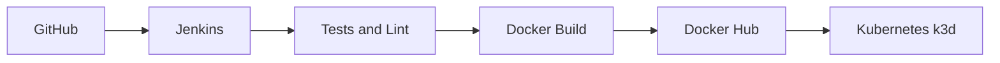

<a id="topo"></a>

# Node.js Jenkins Kubernetes CI/CD Lab

Projeto de portfolio para demonstrar uma esteira de CI/CD aplicada a uma API Node.js com qualidade automatizada, empacotamento em Docker, publicacao em Docker Hub e deploy em Kubernetes k3d via Jenkins.

## Badges planejados

> Espaco reservado para badges reais quando houver integracao publica no GitHub.

<!-- Exemplo futuro:


-->

## Indice

- [Visao geral](#visao-geral)
- [Objetivo do laboratorio](#objetivo-do-laboratorio)
- [Problema que o projeto resolve](#problema-que-o-projeto-resolve)
- [Arquitetura da solucao](#arquitetura-da-solucao)
- [Fluxo CI/CD](#fluxo-cicd)
- [Stack utilizada](#stack-utilizada)
- [Funcionalidades da API](#funcionalidades-da-api)
- [Endpoints da API](#endpoints-da-api)
- [Estrutura do projeto](#estrutura-do-projeto)
- [Como executar localmente](#como-executar-localmente)
- [Como executar com Docker](#como-executar-com-docker)
- [Deploy no Kubernetes](#deploy-no-kubernetes)
- [Pipeline Jenkins](#pipeline-jenkins)
- [Automacao do job Jenkins via API](#automacao-do-job-jenkins-via-api)
- [Credenciais Jenkins](#credenciais-jenkins)
- [Integracao com Docker Hub](#integracao-com-docker-hub)
- [Integracao com Kubernetes/k3d](#integracao-com-kubernetes-k3d)
- [Evidencias visuais](#evidencias-visuais)
- [Troubleshooting](#troubleshooting)
- [Boas praticas demonstradas](#boas-praticas-demonstradas)
- [Proximas melhorias](#proximas-melhorias)
- [Como este projeto demonstra habilidades profissionais](#como-este-projeto-demonstra-habilidades-profissionais)

<a id="visao-geral"></a>
## Visao geral

Este repositorio apresenta a `Order Status API`, uma REST API simples para consulta e criacao de pedidos em memoria, utilizada como base para demonstrar uma esteira realista de entrega continua.

O foco do laboratorio nao e a complexidade de negocio, e sim a demonstracao pratica de habilidades de DevOps e CI/CD:

- validacao automatica com lint e testes
- build de imagem Docker para runtime de producao
- deploy com manifests Kubernetes
- pipeline declarativa no Jenkins

[⬆ Voltar ao topo](#topo)

<a id="objetivo-do-laboratorio"></a>
## Objetivo do laboratorio

Construir um projeto pequeno, legivel e reproduzivel que permita demonstrar:

- desenvolvimento de API Node.js com boas praticas
- testes automatizados com Jest e Supertest
- containerizacao com Docker
- deploy em Kubernetes k3d
- automacao de pipeline com Jenkins

[⬆ Voltar ao topo](#topo)

<a id="problema-que-o-projeto-resolve"></a>
## Problema que o projeto resolve

Em muitos estudos de CI/CD, os exemplos param no build local ou nao conectam validacao, imagem, registro e deploy em uma mesma jornada. Este laboratorio conecta essas etapas em um fluxo unico, facil de explicar em entrevistas e facil de evoluir com evidencias reais.

[⬆ Voltar ao topo](#topo)

<a id="arquitetura-da-solucao"></a>
## Arquitetura da solucao



Componentes principais:

| Componente | Papel no laboratorio |
| --- | --- |
| GitHub | hospeda o codigo e o Jenkinsfile |
| Jenkins | executa a pipeline declarativa |
| Node.js API | aplicacao de exemplo do fluxo |
| Docker | empacota a aplicacao para runtime padronizado |
| Docker Hub | armazena a imagem publicada |
| Kubernetes k3d | recebe o deploy e executa o smoke test interno |

[⬆ Voltar ao topo](#topo)

<a id="fluxo-cicd"></a>
## Fluxo CI/CD

1. O codigo e obtido do SCM pelo Jenkins.
2. A pipeline instala dependencias com `npm ci`.
3. O projeto passa por lint e testes automatizados.
4. A imagem Docker e gerada com tag imutavel e `latest`.
5. A imagem pode ser publicada no Docker Hub.
6. Os manifests Kubernetes sao aplicados.
7. O deployment recebe a nova imagem.
8. O rollout e acompanhado ate concluir.
9. Um smoke test interno valida o endpoint `/health`.

[⬆ Voltar ao topo](#topo)

<a id="stack-utilizada"></a>
## Stack utilizada

| Camada | Tecnologias |
| --- | --- |
| API | Node.js, Express |
| Qualidade | Jest, Supertest, ESLint |
| Container | Docker, Docker Hub |
| CI/CD | Jenkins |
| Orquestracao | Kubernetes, k3d |

[⬆ Voltar ao topo](#topo)

<a id="funcionalidades-da-api"></a>
## Funcionalidades da API

- consulta de status operacional com `/health`
- sinalizacao de readiness com `/ready`
- listagem de pedidos em memoria
- consulta individual por ID
- criacao de pedido com validacao de payload
- respostas JSON padronizadas para sucesso e erro

[⬆ Voltar ao topo](#topo)

<a id="endpoints-da-api"></a>
## Endpoints da API

| Metodo | Endpoint | Descricao |
| --- | --- | --- |
| `GET` | `/health` | health check da aplicacao |
| `GET` | `/ready` | readiness check para runtime e Kubernetes |
| `GET` | `/api/v1/orders` | lista pedidos em memoria |
| `GET` | `/api/v1/orders/:id` | busca um pedido por ID |
| `POST` | `/api/v1/orders` | cria um novo pedido |

Payload de exemplo:

```json
{
  "customerName": "Maria Silva",
  "productName": "Notebook Stand",
  "quantity": 2
}
```

[⬆ Voltar ao topo](#topo)

<a id="estrutura-do-projeto"></a>
## Estrutura do projeto

```text
.
|-- Dockerfile
|-- Jenkinsfile
|-- README.md
|-- docs/
|   |-- architecture.md
|   |-- evidence-checklist.md
|   |-- images/
|   |-- jenkins-setup.md
|   |-- kubernetes-deploy.md
|   `-- troubleshooting.md
|-- scripts/
|   `-- jenkins/
|-- k8s/
|   |-- deployment.yaml
|   |-- kustomization.yaml
|   |-- namespace.yaml
|   `-- service.yaml
|-- src/
|   |-- app.js
|   |-- controllers/
|   |-- middlewares/
|   |-- routes/
|   |-- server.js
|   `-- services/
`-- tests/
    |-- integration/
    `-- unit/
```

[⬆ Voltar ao topo](#topo)

<a id="como-executar-localmente"></a>
## Como executar localmente

1. Instale as dependencias:

```bash
npm install
```

2. Crie o arquivo de ambiente:

```bash
cp .env.example .env
```

3. Inicie a API:

```bash
npm run dev
```

4. Execute a validacao local:

```bash
npm run verify
```

5. Teste um endpoint:

```bash
curl http://localhost:3000/health
```

Variaveis esperadas:

```env
PORT=3000
APP_NAME=Order Status API
APP_VERSION=1.0.0
```

[⬆ Voltar ao topo](#topo)

<a id="como-executar-com-docker"></a>
## Como executar com Docker

Build da imagem:

```bash
docker build -t order-status-api:local .
```

Executar o container:

```bash
docker run --rm -p 3000:3000 order-status-api:local
```

Validar endpoints principais:

```bash
curl http://localhost:3000/health
curl http://localhost:3000/ready
curl http://localhost:3000/api/v1/orders
```

[⬆ Voltar ao topo](#topo)

<a id="deploy-no-kubernetes"></a>
## Deploy no Kubernetes

Os manifests da pasta `k8s/` usam o namespace `jenkins-cicd-lab`.

Se a imagem existir apenas localmente, importe-a no k3d:

```bash
k3d image import order-status-api:local -c <nome-do-cluster>
```

Aplicar os manifests:

```bash
kubectl apply -k k8s/
```

Verificar rollout:

```bash
kubectl -n jenkins-cicd-lab rollout status deployment/order-status-api
kubectl -n jenkins-cicd-lab get pods
kubectl -n jenkins-cicd-lab get svc
```

Smoke test interno:

```bash
kubectl -n jenkins-cicd-lab run curl-smoke --rm -it --restart=Never \
  --image=curlimages/curl -- \
  curl -fsS http://order-status-api.jenkins-cicd-lab.svc.cluster.local:3000/health
```

[⬆ Voltar ao topo](#topo)

<a id="pipeline-jenkins"></a>
## Pipeline Jenkins

O `Jenkinsfile` foi estruturado para um ambiente com Docker, `kubectl`, credencial Docker Hub e credencial kubeconfig.

Estagios implementados:

| Estagio | Objetivo |
| --- | --- |
| `Checkout` | baixa o codigo e monta a tag imutavel |
| `Tooling Info` | exibe versoes das ferramentas do agente |
| `Install Dependencies` | instala dependencias com `npm ci` |
| `Lint` | executa ESLint |
| `Test` | executa a suite automatizada |
| `Build Docker Image` | gera a imagem local |
| `Smoke Test Docker Image` | valida a imagem via `/health` |
| `Push Docker Image to Docker Hub` | publica as tags da imagem |
| `Deploy to Kubernetes` | aplica manifests e atualiza a imagem do deployment |
| `Kubernetes Smoke Test` | testa a API via Service DNS no cluster |
| `Cleanup Local Docker Resources` | remove artefatos locais do job |

Automacao do job:

- o repositorio inclui `scripts/jenkins/create-pipeline-job.mjs` para criar ou atualizar o job ideal no Jenkins via API
- o `dry-run` e o comportamento padrao; o script so chama o Jenkins real com `--apply`
- para este projeto, o melhor ponto de partida e um job dedicado `nodejs-jenkins-k8s-cicd-lab`
- se no futuro voce quiser validar multiplas branches automaticamente, a evolucao natural e `Multibranch Pipeline`

[⬆ Voltar ao topo](#topo)

<a id="automacao-do-job-jenkins-via-api"></a>
## Automação do job Jenkins via API

O projeto inclui um script para criar ou atualizar automaticamente um job Jenkins do tipo `Pipeline from SCM` apontando para este repositório no GitHub.

Esse fluxo foi pensado para o seu Jenkins local em:

```text
http://192.168.15.96:8080
```

Pre-requisitos:

- Jenkins acessivel em `http://192.168.15.96:8080`
- usuario Jenkins com permissao de criacao e configuracao de jobs
- API token criado pelo usuario Jenkins
- repositorio GitHub ja publicado
- `Jenkinsfile` presente na raiz do repositório

Passos recomendados:

```bash
cp .env.jenkins.example .env.jenkins.local
npm run jenkins:job:dry-run
npm run jenkins:job:apply
npm run jenkins:job:apply-build
```

Observacoes importantes:

- o script carrega `.env.jenkins.local` automaticamente quando esse arquivo existir na raiz do projeto
- o `dry-run` e o comportamento padrao do script e apenas mostra o `config.xml` gerado
- a chamada real ao Jenkins so acontece com `--apply`
- o arquivo `.env.jenkins.local` nunca deve ser commitado

Espacos para evidencias futuras:

### Jenkins - Job criado automaticamente

Imagem esperada:

- tela do job `Pipeline from SCM` criado via API no Jenkins

<!-- Adicionar imagem aqui apos execucao real -->

<!-- Exemplo:

-->

[⬆ Voltar ao topo](#topo)

### Jenkins - Pipeline from SCM

Imagem esperada:

- configuracao do job mostrando SCM Git, branch `main` e `Jenkinsfile`

<!-- Adicionar imagem aqui apos configuracao real -->

<!-- Exemplo:

-->

[⬆ Voltar ao topo](#topo)

### Jenkins - Console Output da primeira execucao

Imagem esperada:

- console da primeira build disparada pelo job automatizado

<!-- Adicionar imagem aqui apos execucao real -->

<!-- Exemplo:

-->

[⬆ Voltar ao topo](#topo)

<a id="credenciais-jenkins"></a>
## Credenciais Jenkins

| Credential ID | Tipo recomendado | Uso |
| --- | --- | --- |
| `dockerhub` | `Username with password` | login seguro no Docker Hub e publicacao da imagem |
| `kube` | credencial com kubeconfig | autenticacao do `kubectl` para deploy e validacao |

Observacoes:

- preferir token do Docker Hub no lugar de senha
- nao expor valores em capturas de tela
- revisar permissao do usuario `jenkins` para Docker e acesso ao cluster

[⬆ Voltar ao topo](#topo)

<a id="integracao-com-docker-hub"></a>
## Integracao com Docker Hub

A pipeline foi preparada para publicar a imagem no formato:

```text
$DOCKERHUB_USER/order-status-api
```

Estrategia de tags:

- tag imutavel baseada em `BUILD_NUMBER` e `git short sha`
- tag `latest` para referencia operacional

Importante:

- nao afirmar push concluido sem execucao real da pipeline
- adicionar prints reais na secao de evidencias apenas apos a primeira publicacao

[⬆ Voltar ao topo](#topo)

<a id="integracao-com-kubernetes-k3d"></a>
## Integracao com Kubernetes/k3d

O laboratorio foi preparado para um cluster local k3d com:

- namespace dedicado `jenkins-cicd-lab`
- `Deployment` com 2 replicas
- `Service` `ClusterIP`
- `readinessProbe` em `/ready`
- `livenessProbe` em `/health`

Isso permite demonstrar conceitos de deploy seguro e verificacao de saude da aplicacao.

[⬆ Voltar ao topo](#topo)

<a id="evidencias-visuais"></a>
## Evidencias visuais

> Os espacos abaixo foram preparados para receber prints reais da execucao do laboratorio.

### 1. Jenkins - Pipeline executada com sucesso

Imagem esperada:

- tela da pipeline Jenkins finalizada com sucesso
- visao dos stages executados

<!-- Adicionar imagem aqui apos execucao real -->

<!-- Exemplo:

-->

[⬆ Voltar ao topo](#topo)

### 2. Jenkins - Console Output

Imagem esperada:

- console mostrando lint, testes, build, push e deploy

<!-- Adicionar imagem aqui apos execucao real -->

<!-- Exemplo:

-->

[⬆ Voltar ao topo](#topo)

### 3. Docker Hub - Imagem publicada

Imagem esperada:

- repositorio da imagem com tag imutavel e `latest`

<!-- Adicionar imagem aqui apos push real -->

<!-- Exemplo:

-->

[⬆ Voltar ao topo](#topo)

### 4. Kubernetes - Pods em execucao

Imagem esperada:

- saida de `kubectl get pods -n jenkins-cicd-lab`

<!-- Adicionar imagem aqui apos deploy real -->

<!-- Exemplo:

-->

[⬆ Voltar ao topo](#topo)

### 5. Kubernetes - Rollout status

Imagem esperada:

- saida de `kubectl rollout status` concluida com sucesso

<!-- Adicionar imagem aqui apos validacao real -->

<!-- Exemplo:

-->

[⬆ Voltar ao topo](#topo)

### 6. Smoke test pos-deploy

Imagem esperada:

- resposta do `curl` no cluster para o endpoint `/health`

<!-- Adicionar imagem aqui apos teste real -->

<!-- Exemplo:

-->

[⬆ Voltar ao topo](#topo)

### 7. Jenkins - Credentials e agente Kubernetes, se aplicavel

Imagem esperada:

- IDs das credenciais sem expor segredos
- cloud agent Kubernetes, se esse modo for adotado no futuro

<!-- Adicionar imagem aqui apos configuracao real -->

<!-- Exemplo:


-->

[⬆ Voltar ao topo](#topo)

<a id="troubleshooting"></a>
## Troubleshooting

| Sintoma | Possivel causa | Acao recomendada |
| --- | --- | --- |
| `Docker permission denied` | usuario do Jenkins sem acesso ao daemon | adicionar o usuario ao grupo `docker` e reiniciar a sessao |
| `kubectl sem contexto` | kubeconfig ausente ou invalido | revisar a credencial `kube` e testar os contextos |
| `credencial kube nao encontrada` | ID divergente no Jenkins | confirmar o uso exato de `kube` |
| `Docker Hub login failed` | token ou usuario invalidos | atualizar a credencial `dockerhub` |
| `image pull error` | imagem nao publicada ou tag incorreta | validar nome do repositorio e tag no deployment |
| `pod CrashLoopBackOff` | falha no startup ou probes incorretas | revisar logs, describe e configuracao dos endpoints |
| `Jenkins nao cria agent` | agente offline ou mal configurado | revisar status do node, labels e capacidade de execucao |

Documentacao complementar:

- [docs/troubleshooting.md](docs/troubleshooting.md)

[⬆ Voltar ao topo](#topo)

<a id="boas-praticas-demonstradas"></a>
## Boas praticas demonstradas

- separacao clara entre aplicacao, testes, infraestrutura e documentacao
- API simples e reproduzivel, sem banco externo
- validacao automatizada antes de empacotar e publicar
- imagem Docker enxuta com usuario nao-root
- manifests Kubernetes com probes e recursos definidos
- pipeline declarativa com credenciais protegidas
- documentacao preparada para evidencias reais, sem prints falsos

[⬆ Voltar ao topo](#topo)

<a id="proximas-melhorias"></a>
## Proximas melhorias

- adicionar badge real de pipeline apos integracao no GitHub
- publicar evidencias visuais reais em `docs/images/`
- incluir scanner de vulnerabilidades da imagem
- separar overlays por ambiente com Kustomize
- adicionar estrategia de rollback automatizado
- incluir release notes ou versionamento semantico

[⬆ Voltar ao topo](#topo)

<a id="como-este-projeto-demonstra-habilidades-profissionais"></a>
## Como este projeto demonstra habilidades profissionais

Este repositorio evidencia competencias praticas relevantes para vagas de DevOps, Platform e CI/CD:

- automacao de qualidade e validacao continua
- containerizacao orientada a runtime de producao
- deploy em Kubernetes com verificacao operacional
- documentacao tecnica clara para operacao e portfolio
- preocupacao com rastreabilidade, seguranca e apresentacao profissional

Documentacao auxiliar:

- [docs/architecture.md](docs/architecture.md)
- [docs/jenkins-setup.md](docs/jenkins-setup.md)
- [docs/kubernetes-deploy.md](docs/kubernetes-deploy.md)
- [docs/evidence-checklist.md](docs/evidence-checklist.md)

[⬆ Voltar ao topo](#topo)
